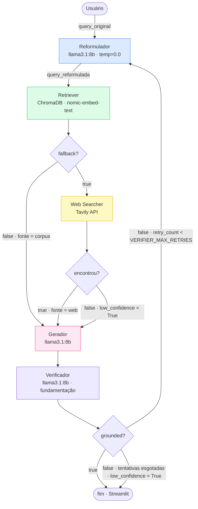

# Arquitetura — F1 RAG System

Sistema multiagente de IA para responder perguntas sobre Fórmula 1.
Combina busca vetorial em corpus próprio (RAG) com fallback para web via Tavily,
e fecha o ciclo com um agente verificador que audita a resposta contra o
contexto recuperado antes de entregá-la, com retentativa automática (loop
de reflexão) quando a fundamentação falha.

---

## Fluxo do sistema



O **Verificador** fecha um loop de reflexão: ele julga, com um terceiro
prompt de LLM, se a resposta do Gerador está de fato fundamentada no
contexto recuperado (corpus e/ou web) — não apenas se alguma fonte foi
encontrada. Se não estiver, o feedback do verificador é injetado no
Reformulador (`agents/reformulator.py`, campo `retry_note`) e o grafo
volta ao início do ciclo de recuperação com uma reformulação mais ampla,
até `VERIFIER_MAX_RETRIES` retentativas (padrão: 1, ou seja, no máximo
2 tentativas completas). Esgotadas as tentativas sem fundamentação
confirmada, o Verificador marca `low_confidence=True` e o sistema
responde mesmo assim, mas com o aviso ao usuário — ele nunca trava.

---

## Por que esse fluxo?

| Decisão | Motivo |
|---|---|
| Reformulador roda sempre | Garante que o Retriever recebe query em inglês formal, vocabulário do corpus |
| Retriever decide o `fallback` | Ele é o dono do contexto de busca — encapsula a lógica de relevância |
| Retentativa sempre também busca web | Achado empírico rodando o benchmark: o Reformulador otimiza a query para vocabulário regulatório formal, o que pode empurrar o score de similaridade acima do threshold contra um chunk que soa relacionado mas não responde a pergunta (falso positivo). Se a 1ª tentativa (só corpus) já foi reprovada pelo Verificador, a retentativa (`retry_count > 0`) sempre aciona o Web Searcher também, independente do score — ver `_route_after_retriever` em `orchestration/orchestrator.py` |
| Orquestrador sem LLM | Transições são lógica determinística sobre o resultado do agente anterior — reduz latência e facilita debugging. Quem decide com LLM são os agentes (Reformulador, Gerador, Verificador), não o grafo |
| Verificador roda sempre, depois do Gerador | "Alguma fonte foi encontrada" (Retriever/Web Searcher) é diferente de "a resposta é fundamentada nela" — o Gerador pode alucinar mesmo com contexto disponível; só um agente dedicado, com esse único objetivo, pega isso |
| Loop de reflexão limitado (`VERIFIER_MAX_RETRIES`) | Sem um teto, uma resposta persistentemente não-fundamentada faria o grafo rodar indefinidamente; com teto, o sistema tenta se corrigir mas sempre converge para uma resposta |
| Terceiro caminho `low_confidence` | Usuário é avisado quando a resposta é incerta (contexto insuficiente ou fundamentação não confirmada mesmo após retentativa), em vez de resposta silenciosamente errada |

---

## GraphState — estado compartilhado entre os agentes

| Campo | Tipo | Escrito por | Lido por |
|---|---|---|---|
| `query_original` | `str` | Orquestrador (START) | Reformulador, Gerador |
| `session_id` | `str` | Orquestrador (START) | Todos (trace) |
| `query_reformulada` | `str` | Reformulador | Retriever, Web Searcher |
| `retriever_result` | `dict` | Retriever | Orquestrador, Gerador, Verificador |
| `web_result` | `dict\|None` | Web Searcher | Orquestrador, Gerador, Verificador |
| `resultados_web` | `list[dict]\|None` | Orquestrador/Web Searcher (compat) | Gerador |
| `encontrou_web` | `bool\|None` | Orquestrador/Web Searcher (compat) | Gerador |
| `generator_result` | `dict` | Gerador | Orquestrador, Verificador, Streamlit |
| `verifier_result` | `dict` | Verificador | Orquestrador (roteamento), Reformulador (retry_note), Streamlit |
| `retry_count` | `int` | Orquestrador (START=0), Verificador | Verificador, roteamento pós-verifier |
| `fonte` | `str` | Orquestrador ou Gerador | Streamlit |
| `low_confidence` | `bool` | Orquestrador, Gerador ou Verificador (ao esgotar retries) | Streamlit |
| `confidence_warning` | `str\|None` | Retriever, Gerador ou Verificador (ao esgotar retries) | Streamlit |
| `resposta` | `str` | Gerador | Orquestrador (END), Streamlit |
| `trace` | `list[dict]` | Todos (append) | Streamlit, export JSON |

### `retriever_result` — shape completo

```python
{
    "query":              str,       # query que foi buscada
    "threshold":          float,     # valor do threshold usado
    "top_k":              int,       # número máximo de resultados pedidos
    "total_hits":         int,       # quantos chunks passaram o threshold
    "best_score":         float,     # score do chunk mais relevante (0.0 se nenhum)
    "fallback_to_web":    bool,      # True se nenhum chunk passou o threshold
    "confidence_warning": str|None,  # aviso quando baixa confiança
    "hits": [
        {
            "content":  str,   # texto do chunk
            "score":    float, # similaridade coseno (0.0 a 1.0)
            "metadata": dict,  # source_file, section, chunk_id, char_count
        }
    ]
}
```

### `web_result` — shape completo

```python
{
    "resultados": [
        {
            "titulo": str,
            "trecho": str,
            "url":    str,
        }
    ],
    "encontrou": bool,
}
```

### `verifier_result` — shape completo

```python
{
    "grounded":      bool,  # True se a resposta está fundamentada no contexto recuperado
    "justification": str,   # justificativa curta dada pelo LLM verificador
    "attempt":       int,   # número da tentativa que foi verificada (1, 2, ...)
    "will_retry":    bool,  # True se o orquestrador vai voltar ao reformulator
}
```

### `trace` — cada agente appenda

```python
{
    "agente":      str,        # "reformulator" | "retriever" | "web_searcher" | "generator" | "verifier"
    "entrada":     str | dict,
    "saida":       str | dict,
    "timestamp":   str,        # ISO 8601
    "latencia_ms": int,
}
```

Numa execução com retentativa, o mesmo `agente` aparece mais de uma vez no
trace (uma entrada por passagem pelo nó) — isso é visível na interface e no
JSON exportado, e é o que evidencia o loop de reflexão em uma consulta ao
vivo.

---

## Contratos dos agentes

| Agente | Arquivo | Usa LLM | Lê do state | Escreve no state |
|---|---|---|---|---|
| **Reformulador** | `agents/reformulator.py` | ✅ llama3.1:8b | `query_original`, `verifier_result` (feedback em retentativa) | `query_reformulada`, `trace` |
| **Retriever** | `agents/retriever.py` | ❌ | `query_reformulada` | `retriever_result`, `trace` |
| **Web Searcher** | `agents/web_searcher.py` | ❌ | `query_reformulada` | `web_result`, `trace` |
| **Gerador** | `agents/generator.py` | ✅ llama3.1:8b | `query_original/query_reformulada`, `retriever_result`, `web_result` (ou `resultados_web`/`encontrou_web`) | `generator_result`, `resposta`, `fonte`, `low_confidence`, `confidence_warning`, `trace` |
| **Verificador** | `agents/verifier.py` | ✅ llama3.1:8b | `query_original`, `generator_result`, `retriever_result`, `web_result`, `retry_count` | `verifier_result`, `retry_count`, `trace`, e `low_confidence`/`confidence_warning` ao esgotar retentativas |
| **Orquestrador** | `orchestration/orchestrator.py` | ❌ | `retriever_result` (roteamento pós-retriever), `verifier_result` (roteamento pós-verifier) | `fonte`, `low_confidence` |

3 dos 5 agentes (Reformulador, Gerador, Verificador) usam um LLM para tomar
uma decisão real — reescrever, sintetizar ou julgar — não apenas para
executar uma chamada de ferramenta. O Orquestrador nunca usa LLM: ele só
aplica lógica determinística sobre o *resultado* de decisões que os agentes
já tomaram.

---

## Stack tecnológico

| Camada | Tecnologia | Onde é usado |
|---|---|---|
| Linguagem | Python 3.11+ | Todo o projeto |
| Orquestração | LangGraph | `orchestration/orchestrator.py` |
| LLM | Ollama · `llama3.1:8b` | Reformulador, Gerador, Verificador |
| Embeddings | Ollama · `nomic-embed-text` | Retriever |
| Vector store | ChromaDB | Retriever |
| Busca web | Tavily API | Web Searcher |
| Interface | Streamlit | `app.py` |
| Infraestrutura | Docker Compose | Serviço `ollama` |
| Testes | pytest | `tests/` |

---

## Variáveis de ambiente

| Variável | Default | Descrição |
|---|---|---|
| `OLLAMA_BASE_URL` | `http://localhost:11434` | Endereço do servidor Ollama |
| `LLM_MODEL` | `llama3.1:8b` | Modelo LLM para Reformulador, Gerador e Verificador |
| `EMBEDDING_MODEL` | `nomic-embed-text` | Modelo de embeddings para o Retriever |
| `CHROMA_PERSIST_DIR` | `./dados/vectorstore` | Caminho do vector store persistente |
| `CHROMA_COLLECTION` | `fia_2026_regulations` | Nome da coleção no ChromaDB |
| `RETRIEVER_THRESHOLD` | `0.75` | Similaridade mínima para usar um chunk |
| `RETRIEVER_TOP_K` | `5` | Número máximo de chunks retornados |
| `TAVILY_API_KEY` | — | Chave da API Tavily (obrigatória para web search) |
| `VERIFIER_MAX_RETRIES` | `1` | Nº máximo de retentativas do loop de reflexão (1 = no máx. 2 tentativas completas) |
| `TRACES_DIR` | `./traces` | Diretório para export de traces JSON |
