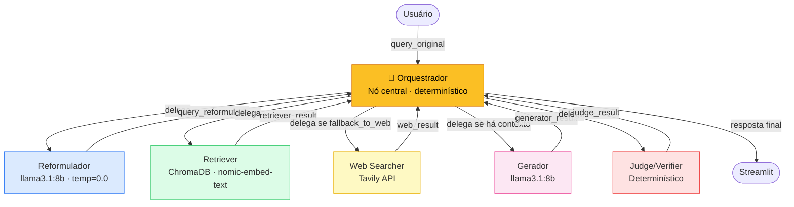

# Arquitetura — F1 RAG System

Sistema multiagente de IA para responder perguntas sobre Fórmula 1.
Combina busca vetorial em corpus próprio (RAG) com fallback para web via Tavily.

---

## Fluxo do sistema (hub-and-spoke)

O Orquestrador é um nó central explícito. Todo agente, ao terminar, retorna ao
Orquestrador, que inspeciona o estado e decide qual agente chamar a seguir.
Nenhum agente conhece o próximo.



---

## Decisões do Orquestrador

A cada chamada, o Orquestrador inspeciona o estado e decide o próximo passo.
Toda decisão é determinística (sem LLM) e registrada no trace com `reason`.

| Estado atual | Próximo passo |
|---|---|
| Sem `query_reformulada` | `reformulator` |
| Sem `retriever_result` | `retriever` |
| `fallback_to_web=True` e sem `web_result` | `web_searcher` |
| Corpus + web vazios (sem fonte verificável) | `done` — aborta geração (anti-alucinação) |
| Sem `generator_result` | `generator` (escreve `fonte`/`low_confidence` antes) |
| Sem `judge_result` | `judge` |
| Tudo pronto | `done` — escreve `resposta` final |

---

## Por que esse fluxo?

| Decisão | Motivo |
|---|---|
| Orquestrador como nó central explícito | Garante que toda comunicação passa por ele; agentes ficam desacoplados |
| Orquestrador sem LLM | Transições determinísticas, auditáveis, sem custo de inferência |
| Reformulador sempre executado | Garante query semanticamente otimizada para o corpus FIA (inglês formal) |
| Threshold encapsulado no Retriever | Retriever é o dono do contexto de busca; Orquestrador só consome o flag `fallback_to_web` |
| Anti-alucinação por design (dupla camada) | Orquestrador aborta antes; Generator valida internamente como rede de segurança |
| Judge no final | Sinaliza ao usuário se a resposta tem base verificável (sem loop de revisão) |

---

## GraphState — estado compartilhado entre os agentes

| Campo | Tipo | Escrito por | Lido por |
|---|---|---|---|
| `query_original` | `str` | `run()` (START) | Orquestrador, Gerador |
| `session_id` | `str` | `run()` (START) | Todos (trace) |
| `query_reformulada` | `str` | Reformulador | Orquestrador, Retriever, Web Searcher, Gerador |
| `retriever_result` | `dict` | Retriever | Orquestrador, Gerador, Judge |
| `web_result` | `dict\|None` | Web Searcher | Orquestrador, Gerador, Judge |
| `generator_result` | `dict` | Gerador | Orquestrador, Judge |
| `judge_result` | `dict` | Judge | Orquestrador, Streamlit |
| `needs_revision` | `bool` | Judge | Streamlit |
| `next_step` | `str` | Orquestrador | edge condicional do grafo |
| `fonte` | `str` | Orquestrador | Streamlit |
| `low_confidence` | `bool` | Orquestrador | Streamlit |
| `confidence_warning` | `str\|None` | Orquestrador | Streamlit |
| `resposta` | `str` | Orquestrador | Streamlit |
| `trace` | `list[dict]` | Todos (append) | Streamlit, export JSON |

### `retriever_result` — shape completo

```python
{
    "query":              str,       # query que foi buscada
    "threshold":          float,     # valor do threshold usado
    "top_k":              int,       # número máximo de resultados pedidos
    "total_hits":         int,       # quantos chunks passaram o threshold
    "best_score":         float,     # score do chunk mais relevante (0.0 se nenhum)
    "fallback_to_web":    bool,      # True se nenhum chunk passou o threshold
    "confidence_warning": str|None,  # aviso quando baixa confiança
    "hits": [
        {
            "content":  str,   # texto do chunk
            "score":    float, # similaridade coseno (0.0 a 1.0)
            "metadata": dict,  # source_file, section, chunk_id, char_count
        }
    ]
}
```

### `web_result` — shape completo

```python
{
    "resultados": [
        {
            "titulo": str,
            "trecho": str,
            "url":    str,
        }
    ],
    "encontrou": bool,
}
```

### `generator_result` — shape completo

```python
{
    "result": "ok" | None,   # None quando contexto vazio (anti-alucinação)
    "answer": str,           # texto da resposta (vazio se result=None)
    "reason": str | None,    # motivo do None (apenas quando result=None)
}
```

### `judge_result` — shape completo

```python
{
    "approved":     bool,       # True se resposta aprovada
    "decision":     str,        # "approve" | "revise"
    "sources_used": str,        # eco do generator_result
    "reasons":      list[str],  # ["empty_answer", "no_evidence", "low_confidence"]
}
```

### `trace` — cada agente appenda

```python
{
    "agente":      str,        # "orchestrator" | "reformulator" | "retriever" | "web_searcher" | "generator" | "judge"
    "entrada":     str | dict,
    "saida":       str | dict, # dict estruturado com payload completo
    "timestamp":   str,        # ISO 8601
    "latencia_ms": int,
}
```

O `orchestrator` aparece intercalado entre cada agente — sua `saida` contém
`next_step` e `reason` explicando a decisão.

---

## Contratos dos agentes

| Agente | Arquivo | Usa LLM | Lê do state | Escreve no state |
|---|---|---|---|---|
| **Orquestrador** | `orchestration/orchestrator.py` | ❌ | Todo o estado | `next_step`, `fonte`, `low_confidence`, `confidence_warning`, `resposta`, `trace` |
| **Reformulador** | `agents/reformulator.py` | ✅ llama3.1:8b | `query_original` | `query_reformulada`, `trace` |
| **Retriever** | `agents/retriever.py` | ❌ | `query_reformulada` | `retriever_result`, `trace` |
| **Web Searcher** | `agents/web_searcher.py` | ❌ | `query_reformulada` | `web_result`, `trace` |
| **Gerador** | `agents/generator.py` | ✅ llama3.1:8b | `query_original`, `query_reformulada`, `retriever_result`, `web_result` | `generator_result`, `trace` |
| **Judge/Verifier** | `agents/judge.py` | ❌ | `generator_result`, `retriever_result`, `web_result` | `judge_result`, `needs_revision`, `trace` |

Princípio aplicado: **responsabilidade única e imutável**. Cada agente faz uma coisa
só. O Gerador apenas gera texto a partir do contexto recebido — não calcula
métricas de fonte, não decide nada sobre confiança. Toda coordenação fica no
Orquestrador.

---

## Anti-alucinação por design

Dupla camada de proteção contra respostas sem fonte verificável:

1. **Orquestrador**: antes de delegar ao Gerador, inspeciona `retriever_result.hits`
   e `web_result.resultados`. Se ambos estão vazios, NÃO chama o Gerador — emite
   resposta pre-canned ("informação não encontrada") e finaliza.

2. **Gerador**: como rede de segurança, valida internamente `corpus_context` e
   `web_context`. Se ambos vazios, retorna `{"result": null, "reason": ...}` sem
   instanciar o `ChatOllama`. Garante zero chamada ao LLM sem fonte.

Resultado: nenhuma resposta final pode vir do conhecimento paramétrico do modelo.
Toda saída ou tem evidência rastreável (corpus/web) ou avisa explicitamente que
não tem.

---

## Stack tecnológico

| Camada | Tecnologia | Onde é usado |
|---|---|---|
| Linguagem | Python 3.11+ | Todo o projeto |
| Orquestração | LangGraph | `orchestration/orchestrator.py` |
| LLM | Ollama · `llama3.1:8b` | Reformulador, Gerador |
| Embeddings | Ollama · `nomic-embed-text` | Retriever |
| Vector store | ChromaDB | Retriever |
| Busca web | Tavily API | Web Searcher |
| Interface | Streamlit | `app.py` |
| Infraestrutura | Docker Compose | Serviço `ollama` |
| Testes | pytest | `tests/` |

---

## Variáveis de ambiente

| Variável | Default | Descrição |
|---|---|---|
| `OLLAMA_BASE_URL` | `http://localhost:11434` | Endereço do servidor Ollama |
| `LLM_MODEL` | `llama3.1:8b` | Modelo LLM para Reformulador e Gerador |
| `EMBED_MODEL` | `nomic-embed-text` | Modelo de embeddings para o Retriever |
| `CHROMA_PERSIST_DIR` | `./dados/vectorstore` | Caminho do vector store persistente |
| `CHROMA_COLLECTION` | `fia_2026_regulations` | Nome da coleção no ChromaDB |
| `RETRIEVER_THRESHOLD` | `0.75` | Similaridade mínima para usar um chunk |
| `RETRIEVER_TOP_K` | `5` | Número máximo de chunks retornados |
| `TAVILY_API_KEY` | — | Chave da API Tavily (obrigatória para web search) |
| `TRACES_DIR` | `./traces` | Diretório para export de traces JSON |
